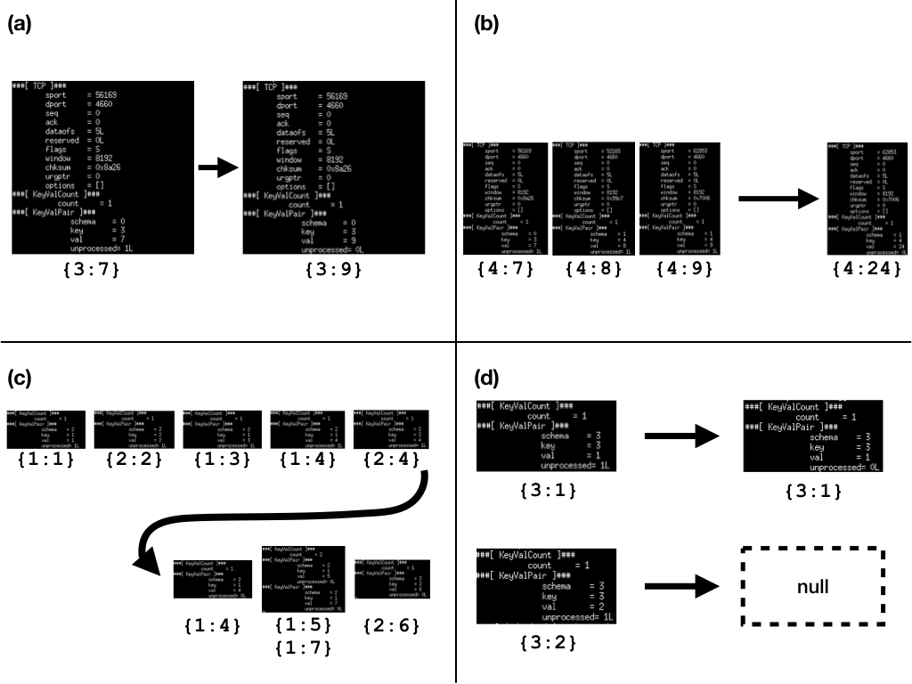

# Implementing Stream Operations in P4 
## Sammy Moseley
### December, 2018

This writeup is divided into three sections: overview, implementation, and application.

## Overview

Stream operations are query operations tailored towards streams of data. There are multiple representations of streams of data, however, to simplify implementation I use schema-key-value tuples. 

I used _The CQL Continuous Query Language: Semantic Foundations and Query Execution_ by Arvind Arasu, _et al._ as a guide to choose stream relation operators. I chose four building block stream operators. I provide example queries that make use of the stream operators -- the current system does not have the full functionality necessary to compute these queries, however, the analogous operator logic has been implemented.

 - __Map__ - `Select speed/2 From PosSpeedStr`
 - __Filter__ - `Select Istream(*) From PosSpeedStr [Range Unbounded] Where speed > 65`
 - __Join__ - `Select Distinct L.vehicleId, L.segNo, L.dir, L.hwy From SegSpeedStr [Range 30 Seconds] as A, SegSpeedStr [Partition by vehicleId Rows 1] as L Where A.vehicleId = L.vehicleId`
 - __Aggregate__ - `Select segNo, dir, hwy From SegSpeedStr [Range 5 Minutes] Group By segNo, dir, hwy`


With these operations, generic stream queries should be able to be computed on the router.

Queries are defined per schema by a developer. The queries should then be translated to stream operators (the above 5 operators) and then sent to routers.


## Implementation

The stream query packets are a stack of tuples (schema, key, value). Initially, each packet would be a single event in the stream, however, difficulties with the P4 compiler necessitated that I use a stack.

Currently queries are computed on a single router, though, further implementation could distributed computations across routers. Currently there is no distributed computing protocol. For example, aggregate operators are done on a per router basis.

### Operators
All stream operators have been implemented in P4. Operators that need to buffer data use a register to store historical data.

#### Map
Map is implemented as a single operation that changes the value or key of the key-value pair.

#### Filter
Filter drops a packet if a the key or value matches some value.

#### Join
Join computes a join for a schema where some join condition, `c`. The join is computed across buffered historical tuples for a stream and a join function is applied to joined tuples to generate the new value. The join operator makes use of the recirculate operator which reduces the throughput of the router. I have not addressed how to accelerate this or how to scale this more effectively.

#### Aggregate
Aggregate computes an aggregate using some aggregate function over the buffered historical values for a schema-key pair.

### Packet Protocol
```
struct headers {
    ethernet_t   ethernet;
    ipv4_t       ipv4;
    tcp_t        tcp;
    entry_count_t entry_count;
    entry_t[10] entry;
    entry_t entry_swap;
}
```

The stream operator implementation identifies stream query packets as those with destination `Ox1234` in the TCP header. `entry_swap` is used to swap event entries during packet processing.

```
header entry_t {
    bit<32> schema;
    bit<32> key;
    bit<32> val;
    bit<8> unprocessed;
}
```

An entry keeps track of whether it has been processed or not. When one router has processed an event, succeeding routers know not to process the event.

### Operator Compiler
There is no compiler for a standard or continuous query language (QL) to the P4 query operators. I have added Python representations of the operators which can then be written to the action table for the switches. A QL compiler would simply need to output the queries in this Python representation to install the queries on the routers.

### Stream Operator Example



A simple demo was made using the Python controller interface. The general format of a Python stream query is `Query(s, l)`, where `s` is the schema identifier and `l` is the ordered list of operators to be applied.

Figure 1(a) shows the map operator. The Python representation of this stream query is `Query(0, [MapAdd(1), MapAdd(1)])`. Notice how data is mapped one-to-one and that the values are incremented by 2.

Figure 1(b) shows the aggregate operator. The Python representation of this stream query is `Query(1, [KeyWindowAggregate()])`. A rolling average is taken, so this query is also one-to-one in the events received and events emitted. Notice how after three incoming packets, and the rolling sum of them is outputted (this does not show the previous two aggregates also outputted).

Figure 1(c) shows the join operator . The Python representation of this stream query is `Query(2, [JoinSum()])`. A stream window join is computed. Since there may be none, one, or many join results after an incoming stream events this is one-to-many (where many can also be one or none). Notice that after the third event with key `1` is received, an output of two events is created since there are two other events with key `1` in the window. Values are summed for the join operator when a join result is created.

Figure 1(d) shows the filter operator. The Python representation of this stream query is `Query(3, [FilterEq(2)])`. The filter operator filters events where the key or value has some condition. In this case, we test whether the value equals 2. This is a one-to-some (i.e. one or none) operator.

### Implementation Weaknesses

Since memory is bounded there is an upper-bound on the number of schemas that a single router can handle. I have not calculated this rigorously, however, once there are cash collision on schema identifiers then there will be undefined behavior since the router will clear buffers competing schemas.

## Applications

Arvind Arasu, _et al._ introduce dynamic tolling for traffic systems as an application of streaming queries. 

Autonomous cars have the potential to drive more efficiently. Their efficiency is in part because they can share information between cars. Some of this information will be specific to the location of the car (e.g. known road hazards, congestion statistics). Rather than using a central database to serve requests about this data, some of these queries can be directly processed within the network. Transportation traffic queries typically aggregate by location (e.g. for a segment of road), and the network topology may have analogies to the road network, switches can elegantly and in a distributed manner implement these queries.